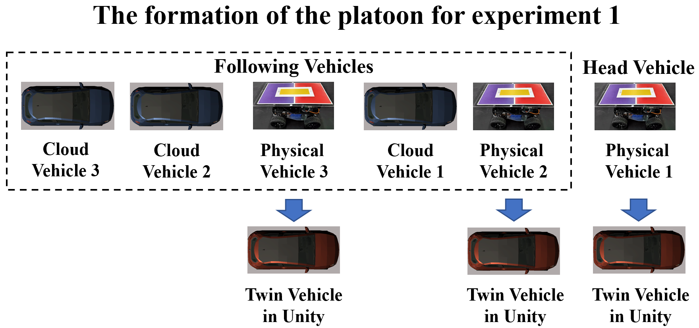
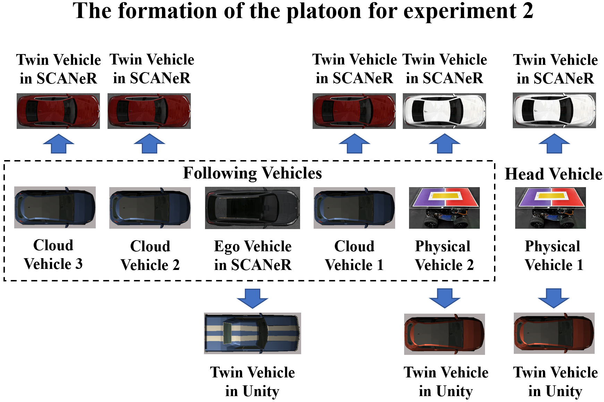

<!--课题组网站链接-->
[](https://www.labxing.com/thicv)

<!---用到的系统-->
<a></a>
<a></a>

<!--硬件条件-->


_Gold_5220R_@2020GHz-0071C5?style=for-the-badge&logo=intel&logoColor=white)


<!--用到的语言-->
<a></a>
<a></a>
<a></a>
<a></a>

<!--用到的软件-->

<a></a>


# SICity 

In this project, we present several experiments done with SICity to demonstrate its capabilities. 

# Platoon experiment with mixed types of vehicles

## Mixing physical vehicles and cloud vehicles

### The formation of the platoon for experiment 1 is shown below.



### The video of the experiment process is shown below.


## Mixing physical vehicles, cloud vehicles and the driving simulator

### The formation of the platoon for experiment 2 is shown below.



### The video of the experiment process is shown below.


# Multi-vehicle coordinated formation control

The video can be found on another [``GitHub repository``](https://github.com/cmc623/Formation-control-experiments).

# Data-EnablEd Predictive Leading Cruise Control (DeeP-LCC)

The video can be found on another [``GitHub repository``](https://github.com/soc-ucsd/DeeP-LCC).

## Publications
1. Yang C, Dong J, Xu Q, et al. Multi-vehicle experiment platform: A Digital Twin Realization Method[C]//2022 IEEE/SICE International Symposium on System Integration (SII). IEEE, 2022: 705-711. [paper link](https://www.researchgate.net/publication/359072029_Multi-vehicle_experiment_platform_A_Digital_Twin_Realization_Method)
2. Cai M, Xu Q, Yang C, et al. Experimental Validation of Multi-lane Formation Control for Connected and Automated Vehicles in Multiple Scenarios[J]. arXiv preprint arXiv:2112.00312, 2021. [paper link](https://www.researchgate.net/publication/356711150_Experimental_Validation_of_Multi-lane_Formation_Control_for_Connected_and_Automated_Vehicles_in_Multiple_Scenarios)

## Contacts
Follow my updates on [Researchgate](https://www.researchgate.net/profile/Jianghong-Dong).

## Citing SICity

If you refer to SICity in your research, please cite the [paper](https://www.researchgate.net/publication/359072029_Multi-vehicle_experiment_platform_A_Digital_Twin_Realization_Method). In BibTeX format:

```bibtex
@INPROCEEDINGS{yang2021multi, 
author={Yang, Chunying and Dong, Jianghong and Xu, Qing and Cai, Mengchi and Qin, Hongmao and Wang, Jianqiang and Li, Keqiang},  
booktitle={2022 IEEE/SICE International Symposium on System Integration (SII)},  
title={Multi-vehicle experiment platform: A Digital Twin Realization Method},   
year={2022},  
volume={},  
number={},  
pages={705-711},  
doi={10.1109/SII52469.2022.9708890}}
```

