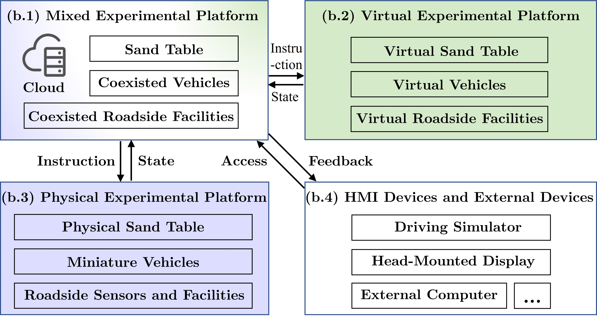
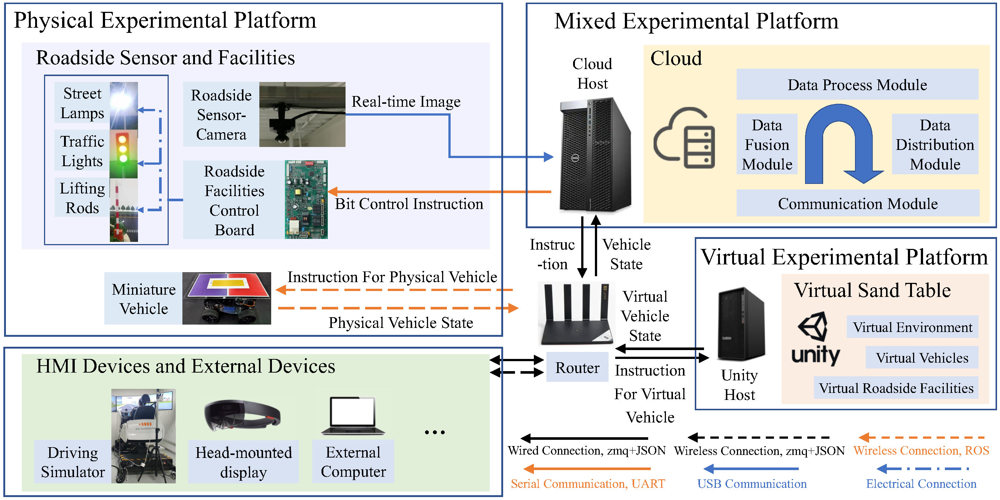

<!--课题组网站链接-->
[](https://www.labxing.com/thicv)

<!---用到的系统-->
<a></a>
<a></a>

<!--硬件条件-->


_Gold_5220R_@2.20GHz-0071C5?style=for-the-badge&logo=intel&logoColor=white)


<!--用到的语言-->
<a></a>
<a></a>
<a></a>
<a></a>


<!--用到的软件-->

<a></a>


# Mixed Cloud Control Testbed (MCCT)

In this project, we present demo videos for our miniature experimental platform, Mixed Cloud Control Testbed (MCCT), developed based on a new notion of Mixed Digital Twin (mixedDT). 

## The notion of mixedDT
Combining Mixed Reality with Digital Twin, mixedDT integrates the virtual and physical spaces into a mixed one, where physical entities coexist and interact with virtual entities via their digital counterparts. 

The schematic diagram of the classical Digital Twin is as follows.


The schematic diagram of the proposed mixedDT is as follows.


## The architecture of the MCCT

Under the framework of mixedDT, MCCT contains three major experimental platforms in the physical, virtual and mixed spaces respectively, and provides a unified access for various human-machine interfaces and external devices such as driving simulators.



An corresponding overview of the MCCT is as follows.


The detailed physical architecture of the MCCT is as follows, which is not presented in paper due to space limitations.



## Demo videos
Cross-platform experiments are carried out on vehicle platooning, which is composed of different types of vehicles from different platforms in MCCT.

**Experiment A:** Mixing physical miniature vehicles and virtual vehicles

The formation of the platoon for experiment A is shown below.


The video of the experiment process is shown below.


**Experiment B:** Mixing physical miniature vehicles, virtual vehicles and a human-driven vehicle via a driving simulator

The formation of the platoon for experiment B is shown below. SCANeR Studio is the supporting software of the driving simulator. 


The video of the experiment process is shown below.


<!--还没放上去，先不放
More longer videos can be found on [](https://github.com/cmc623/Formation-control-experiments).
-->

## More experiments on MCCT
- Multi-vehicle coordinated formation control. [](https://github.com/cmc623/Formation-control-experiments)
- Data-Enabled Predictive Leading Cruise Control (DeeP-LCC). [](https://github.com/soc-ucsd/DeeP-LCC)

## Related publications
1. Yang C, Dong J, Xu Q, et al. Multi-vehicle experiment platform: A Digital Twin Realization Method[C]//2022 IEEE/SICE International Symposium on System Integration (SII). IEEE, 2022: 705-711. [paper link](https://www.researchgate.net/publication/359072029_Multi-vehicle_experiment_platform_A_Digital_Twin_Realization_Method)
2. Cai M, Xu Q, Yang C, et al. Experimental Validation of Multi-lane Formation Control for Connected and Automated Vehicles in Multiple Scenarios[J]. arXiv preprint arXiv:2112.00312, 2021. [paper link](https://www.researchgate.net/publication/356711150_Experimental_Validation_of_Multi-lane_Formation_Control_for_Connected_and_Automated_Vehicles_in_Multiple_Scenarios)
3. Wang J, Zheng Y, Dong J, et al. Experimental Validation of DeeP-LCC for Dissipating Stop-and-Go Waves in Mixed Traffic[J]. arXiv preprint arXiv:2204.03747, 2022. [paper link](https://arxiv.org/abs/2204.03747)
4. Dong J, Xu Q, Wang J, et al. Mixed Cloud Control Testbed: Validating Vehicle-Road-Cloud Integration via Mixed Digital Twin[J]. arXiv preprint arXiv:2212.02007, 2022.

## Citing MCCT
If you refer to MCCT in your research, please cite the [paper](https://arxiv.org/abs/2212.02007). In BibTeX format:

```bibtex
@article{dong2022mixed,
  title={Mixed Cloud Control Testbed: Validating Vehicle-Road-Cloud Integration via Mixed Digital Twin},
  author={Jianghong Dong and Qing Xu and Jiawei Wang and Chunying Yang and Mengchi Cai and Chaoyi Chen and Jianqiang Wang and Keqiang Li},
  journal={arXiv preprint arXiv:2212.02007},
  year={2022}
}
```

## Contacts
For more details, please contact [Jianghong Dong](https://www.researchgate.net/profile/Jianghong-Dong) and [Jiawei Wang](https://wangjw18.github.io/).

